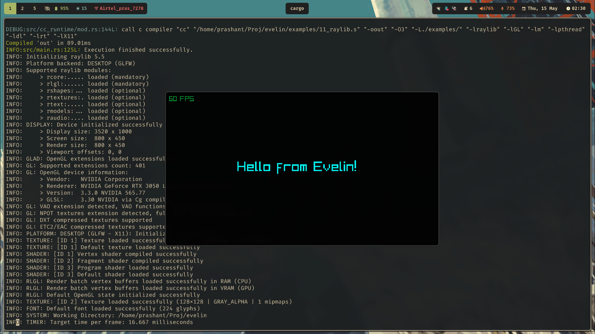

## Language Guide

Evelin's syntax is designed to be simple and C-like. The BNF notation of the syntax can be found [here](./syntax-spec.md).

### Hello world

```rust
fn main() -> void {
    print "Hello, world!";
}
```

Execution in Evelin starts from the `main` function.Save the Hello World example in a file (e.g., main.eve) and build it with:
```sh
evelin ./main.eve
```

Now you can run the output binary:

```sh
./out
```

### Variables, also known as bindings
Variables can be created using the `let` keyword. You can comment a line using `//`.
```rust
fn main() -> void {
  // this line is a comment

  // Temporary variable declarations are only allowed inside functions.
  let a = 3;
  let b = 1;
  a = a + 5; // updating existing binding

  print a + b; // 9
}
```

### Strings
Strings are created using the same syntax
```rust
fn main() -> void {
  let a = "Strings are easy\n";
  print a;

  let b = "Even
multi-line
strings
are easy";

  print b;
}
```

### Branching
Evelin supports branching via `if-else`.
```rust
fn main() -> void {
  let a = 3;
  if (a == 3) {
    print "a is 3\n";
  }

  let b = 4;
  if (b < 0) {
    print "math error";
  } else {
    print "4 is greater than 0";
  }
}
```


### Functions
User functions can be defined using the following syntax. All user-defined functions can have at most one parameter and can be called with only one argument.
```rust
fn increment(n: int) -> int {
  return n + 1;
}

fn main() -> void {
  let a = increment(3);
  print a;
}
```

### Loops
Evelin supports basic looping using the `loop` keyword, and `break` can be used to break out of the loop. Syntactic sugar such as for and while loops can be built using it.
```rust
fn main() -> void {
  let a = 0;
  loop {
     print a;
     a = a + 1;
     if (a > 10) {
       break;
     }
  }
}
```

Alternatively, recursion can be used to run the same code multiple times.
```rust
fn print_numbers_recursive(n: int) -> int {
  if (n < 0) {
    return;
  }

  print_numbers_recursive(n - 1);
  print n;
  print "\n";
}

fn main() -> void {
  print_numbers_recursive(10);
}
```

### Structures
Evelin supports structs. All fields are required to be initialized when creating a struct instance.
```rust
struct Vec2 {
  x: float,
  y: float
}

fn main() -> void {
  // struct initialization
  let a = Vec2 { x: 1.0, y: 3.0 };
  let b = Vec2 { x: 3.0, y: 4.0 };
  let slope = (b.y - a.y) + (b.x - a.x);
  print slope;
}
```

Structs can be used to pass multiple values to a function

```rust
struct TwoVal {
  x: int,
  y: int
}

fn add(values: TwoVal) -> int {
  return values.x + values.y;
}

fn main() -> void {
  let a = TwoVal { x: 1, y: 3 };
  print add(a);
}
```

### Foreign Function Interface (ffi)
Evelin supports calling functions from other languages that use the C ABI. Foreign functions can be called using the `extern` keyword. All foreign functions can take multiple arguments, unlike Evelin functions.
```rust
fn main() -> void {
  let a = 1;
  let b = 1;
  let fmt = "%d + %d = %d";
  extern printf(fmt, a, b, a + b);
}

```
#### Cowsay via ffi

[Cowsay program](http://en.wikipedia.org/wiki/Cowsay) implemented in C.
```c
// Compile using: cc -c 10_cowsay.c -o libcowsay.a
#include <stdio.h>
#include <string.h>

void print_border(int len) {
  printf(" ");
  for (int i = 0; i < len + 2; i++)
    printf("-");
  printf("\n");
}

void print_cow() {
  printf("        \\   ^__^\n");
  printf("         \\  (oo)\\_______\n");
  printf("            (__)\\       )\\/\\\n");
  printf("                ||----w |\n");
  printf("                ||     ||\n");
}

void cowsay(char *message) {
  int len = strlen(message);
  print_border(len);
  printf("< %s >\n", message);
  print_border(len);
  print_cow();
}
```

Calling it from Evelin.
Ensure that the static library file `libcowsay.a` is in the same directory.
```rust
// Compile using: evelin 10.eve -lcowsay -L.
fn main() -> void {
  extern cowsay("Hi from Evelin!!");
}
```


### Modules
Each Evelin file (`.eve`) is a module. All modules can be compiled together into a single binary, allowing code to be split across multiple files.

```rust
// file: A.eve
fn increment(n: int) -> int {
  return n + 1;
}
```

```rust
// file: B.eve
fn main() -> void {
  print increment(2);
}
```

All files can be compiled together simply by passing them to the compiler.
```
Evelin A.eve B.eve
```

### Raylib example

[Raylib](https://www.raylib.com/) is, according to the author's words, "a simple and easy-to-use library to enjoy videogames programming."

Raylib can be used from Evelin via ffi.
```rust
fn main() -> void {
    extern InitWindow(800, 450, "Raylib Window Title");
    extern SetTargetFPS(60);

    loop {
      if (extern WindowShouldClose() != 0) {
        break;
      }

      extern BeginDrawing();

      let cyan = extern GetColor(16777215);
      let black = extern GetColor(0);

      extern ClearBackground(black);
      extern DrawText("Hello from Evelin!", 210, 200, 40, cyan);
      extern DrawFPS(10, 10);

      extern EndDrawing();
    }

    extern CloseWindow();
}
```
Ensure that the static library file `libraylib.a` is in the same directory.
Then compile using:
```sh
evelin raylib.eve -lraylib -L. -lGL -lm -lpthread -ldl -lrt -lX11
```
Noe: The -L flag tells the linker where to find the Raylib library. '.' refers to the current directory.

If Raylib is properly configured on your system. Running the output binary should yield something like:


