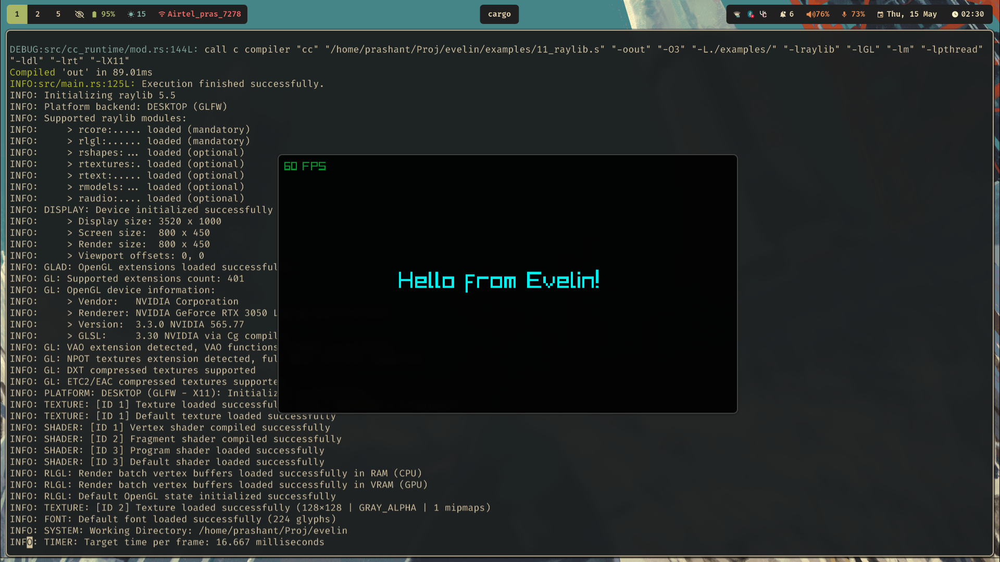

## Evelin
Evelin is a general purpose, statically typed, compiled language.

It is currently supported on amd64 (linux and MacOS), arm64, and riscv64. It uses [QBE backend](https://c9x.me/compile/) to generate platform-dependent machine code and the host machine's C compiler to build the final binary.

Here's a Hello World program in Evelin:
```rust
fn main() -> void {
  print "Hello, World!";
}
```
Here's [Raylib](https://raylib.com) via Evelin:



### Getting started
See the [installation guide](./INSTALL.md).

### Language guide
Learn how to use Evelin through examples. See the [language guide](./GUIDE.md).
